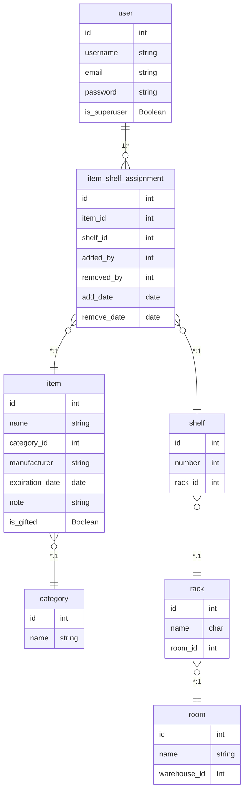

# KSP - Krwinkowy System Prezentowy

KSP (Krwinkowy System Prezentowy) is an inventory management system (IMS) developed for CE Tech Hub Hackathon 2025. The application is designed to manage warehouse items with specific requirements for a charity's storage system.

## Features

- User authentication system with admin and standard user roles
- Warehouse organization with rooms, racks, and shelves
- Item tracking with categories, expiration dates, and location
- Mobile-responsive interface for easy inventory management
- QR code generation for quick access to shelf information
- Excel export functionality for inventory reports
- Email notifications for expiring items
- Multiple language support (Polish and English)

## Requirements

- Docker compose for deployment
- Python > 3.12 & UV package manager for local development

## Quick Start Guide

### 1. Clone the repository

```bash
git clone https://github.com/yourusername/ce-it-hub-hackathon-2025.git
cd ce-it-hub-hackathon-2025
```

### 2.A Use uv to create a virtual environment and install dependencies

[Install uv](https://docs.astral.sh/uv/getting-started/installation/#installing-uv)
```bash
uv sync
```

### 3. Configure environment variables

Copy the example environment file and update it with your settings:

```bash
cp .env.example .env
```

Edit the `.env` file with your specific configuration:
- Set a secure `SECRET_KEY`
- Configure email settings for password reset functionality
- The IP host will be set automatically after running `docker compose up`

### 4.A Use docker compose and run databse migrations and superuser creation
```bash
docker compose up --build
./scripts/manage_django.sh
```

### 4.B ONLY IF NOT USING DOCKER COMPOSE


```bash
uv run manage.py migrate
uv run manage.py createsuperuser
uv run manage.py runserver
```

The application will be available at http://127.0.0.1:80/

## Project Structure

- `warehouse/` - Main application for inventory management
- `ksp/` - Project settings
- `static/` - Static files (CSS, JS, images)
- `templates/` - HTML templates
- `media/` - User-uploaded files (created when needed)
- `locale/` - Translation files for multi-language support

## User Types

1. **Warehouse Administrator**:
   - Full access to all application features
   - Can manage warehouse structure (rooms, racks, shelves)
   - Can create/manage item categories

2. **Regular User**:
   - Can view the inventory
   - Can add/remove items from shelves
   - Can filter and search for items

## Deployment

For production deployment:

1. Set `DEBUG=False` in your environment
2. Configure the `ALLOWED_HOSTS` setting

## Additional Documentation

- [DEPLOY.md](DEPLOY.md) - Detailed deployment instructions
- [DEVELOPMENT.md](DEVELOPMENT.md) - Development setup and troubleshooting
- [STATIC_FILES_TROUBLESHOOTING.md](STATIC_FILES_TROUBLESHOOTING.md) - Help with static files issues
- [QR_CODE_TESTING.md](QR_CODE_TESTING.md) - Guide for testing QR code functionality

## License

This project is licensed under the MIT License - see the [LICENSE](LICENSE) file for details.

## Acknowledgements

Developed for CE Tech Hub Hackathon 2025.

## Data Model

