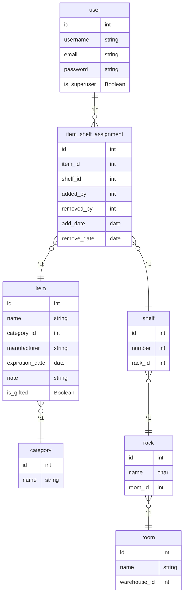

# KSP - Krwinkowy System Prezentowy

KSP (Krwinkowy System Prezentowy) is an inventory management system (IMS) developed for CE Tech Hub Hackathon 2025. The application is designed to manage warehouse items with specific requirements for a foundation's storage system.

## Features

- User authentication system with admin and standard user roles
- Warehouse organization with rooms, racks, and shelves
- Item tracking with categories, expiration dates, and location
- Mobile-responsive interface for easy inventory management
- QR code generation for quick access to shelf information
- Excel export functionality for inventory reports
- Email notifications for expiring items
- Multiple language support (Polish and English)

## Requirements

- Python 3.8 or higher
- Django 5.0 or higher
- Additional dependencies listed in `requirements.txt`
- (Recommended) Python package manager: UV

## Quick Start Guide

### 1. Clone the repository

```bash
git clone https://github.com/yourusername/ce-it-hub-hackathon-2025.git
cd ce-it-hub-hackathon-2025
```

### 2.A Use uv to create a virtual environment and install dependencies

[Install uv](https://docs.astral.sh/uv/getting-started/installation/#installing-uv)
```bash
uv sync
```

### 2.B (alternative if not using uv) Create venv and install dependencies

```bash
source .venv/bin/activate  # On Windows, use: venv\Scripts\activate
```

### 3. Configure environment variables

Copy the example environment file and update it with your settings:

```bash
cp .env.example .env
```

Edit the `.env` file with your specific configuration:
- Set a secure `SECRET_KEY`
- Configure email settings for password reset functionality

### 4. Set up the database

```bash
uv run manage.py migrate
```
or
```bash
python manage.py migrate
```

### 5. Create a superuser (admin account)

```bash
uv run manage.py createsuperuser
```
or
```bash
python manage.py createsuperuser
```

### 6. Run the development server

```bash
uv run manage.py runserver
```
or
```bash
python manage.py runserver
```

The application will be available at http://127.0.0.1:8000/

### 7. Access the admin interface

Visit http://127.0.0.1:8000/admin/ and log in with the superuser credentials.

## Running with Docker

### 1. Build and start the containers

```bash
docker compose up --build
```

This will start both the Django application and a PostgreSQL database.

### 2. Run database migrations

In a separate terminal, run:

```bash
docker compose exec web uv run manage.py migrate
```

### 3. Create a superuser (admin account)

```bash
docker compose exec web uv run manage.py createsuperuser
```

### 4. Access the application

Visit [http://127.0.0.1:8000/](http://127.0.0.1:8000/) in your browser.

- The admin interface is at [http://127.0.0.1:8000/admin/](http://127.0.0.1:8000/admin/)

## Project Structure

- `warehouse/` - Main application for inventory management
- `ksp/` - Project settings
- `static/` - Static files (CSS, JS, images)
- `templates/` - HTML templates
- `media/` - User-uploaded files (created when needed)

## User Types

1. **Warehouse Administrator**:
   - Full access to all application features
   - Can manage warehouse structure (rooms, racks, shelves)
   - Can create/manage item categories

2. **Regular User**:
   - Can view the inventory
   - Can add/remove items from shelves
   - Can filter and search for items

## Deployment

For production deployment:

1. Set `DEBUG=False` in your environment
2. Configure the `ALLOWED_HOSTS` setting
3. Use a production-grade web server (e.g., Gunicorn, uWSGI)
4. Set up a reverse proxy (e.g., Nginx)

## Known Issues and Solutions

### QR Codes with Localhost URLs

**Issue**: QR codes may generate URLs using "localhost" instead of the network IP address, making them inaccessible on mobile devices.

**Solution**: Use the provided utility script to fix this issue:

```bash
./fix_network_ip.sh
```

This script will:
1. Detect your network IP address
2. Update docker-compose.yaml with the correct IP
3. Restart the containers if requested

Alternatively, you can manually set the IP in docker-compose.yaml:
```yaml
environment:
  # Other environment variables...
  - NETWORK_HOST=192.168.x.x  # Replace with your actual network IP
```

### Docker Compose Version Warning

**Issue**: You may see a warning about an obsolete version directive in docker-compose.yaml.

**Solution**: Run the provided script to fix this issue:

```bash
./fix_docker_compose_version.sh
```

## Additional Documentation

- [DEPLOY.md](DEPLOY.md) - Detailed deployment instructions
- [DEVELOPMENT.md](DEVELOPMENT.md) - Development setup and troubleshooting
- [STATIC_FILES_TROUBLESHOOTING.md](STATIC_FILES_TROUBLESHOOTING.md) - Help with static files issues
- [QR_CODE_TESTING.md](QR_CODE_TESTING.md) - Guide for testing QR code functionality

## License

This project is licensed under the MIT License - see the [LICENSE](LICENSE) file for details.

## Acknowledgements

Developed for CE Tech Hub Hackathon 2025.

## Data Model

