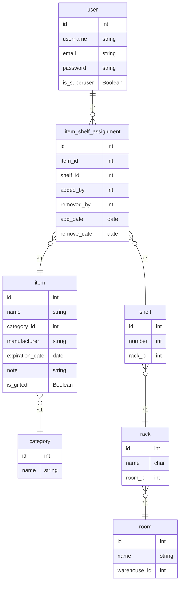

---
hide:
  - navigation
---

### Test QR Code Functionality

The application generates QR codes for each shelf that can be scanned with mobile devices to quickly access shelf information. For this to work correctly:

1. Test the QR codes by:  
   -Navigating to a shelf detail page (eg. `/warehouse/shelves/1`)  
   -Scanning the QR code with a mobile device  
   -Confirming it connects to the correct shelf page

2. If the code scanning does not work or if QR codes show "localhost" URLs (which won't work on mobile devices), you need to set the `NETWORK_HOST` environment variable to your server's IP address or domain name, by running `./scripts/set_network_ip.sh`.  
You can check if it got correctly set in the `.env` file.  
You should see: `NETWORK_HOST=your-server-ip-or-hostname`

### App translations
Translations are automatically generated and come bundled in this git repo.  
This document is only applicable if you need to regenerate them yourself after changing something in the code.

You need to have gettext installed (https://www.drupal.org/docs/8/modules/potion/how-to-install-setup-gettext).

Then, run the following commands.

```sh
uv run python manage.py makemessages -l en -l pl
uv run python manage.py compilemessages -l en -l pl
```

### Updating the Application

```sh
git pull
docker compose down
docker compose up -d --build
```

### Backing Up the Database
Consider regular database backups for production deployments.  
Refer to the values you set in .env file in the following command.
```sh
docker compose exec db pg_dump -U <DB_USER> <DB_NAME> > backup_$(date +%Y%m%d).sql
```
Restore from a file:
```sh
docker compose exec -T db psql -U <DB_USER> <DB_NAME> < <FILENAME>.sql
```

### Viewing Logs

```sh
# Web application logs
docker compose logs web

# Nginx logs
docker compose logs nginx

# Database logs
docker compose logs db
```

### Database Data Model

