---
hide:
  - navigation
  - toc
---

### Create your user
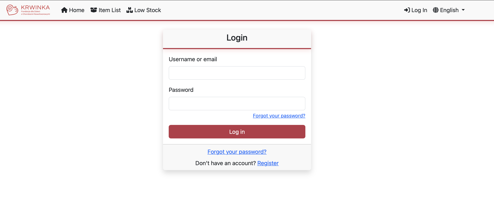

### Reset your password
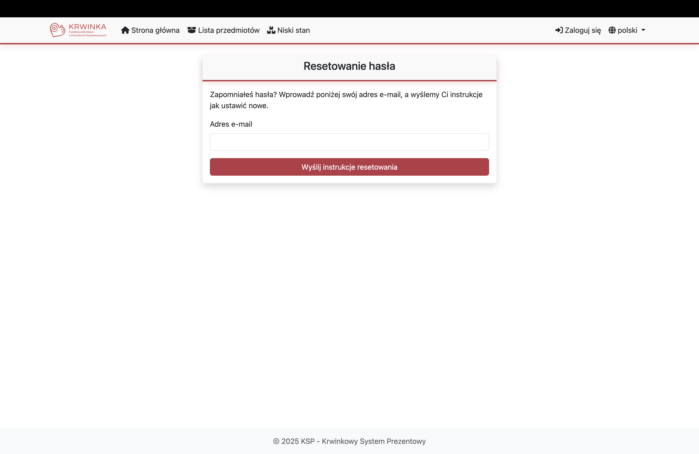

### Manage item categories (admin only)
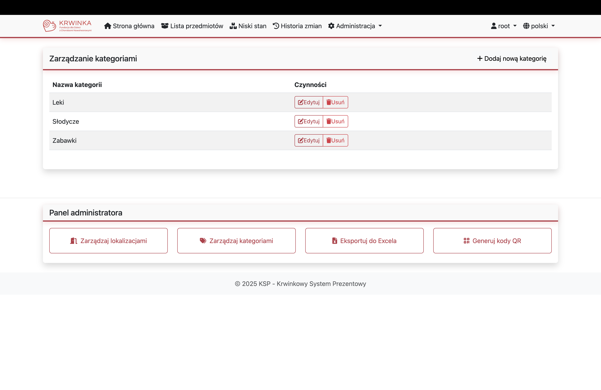

### Manage warehouse rooms (admin only)
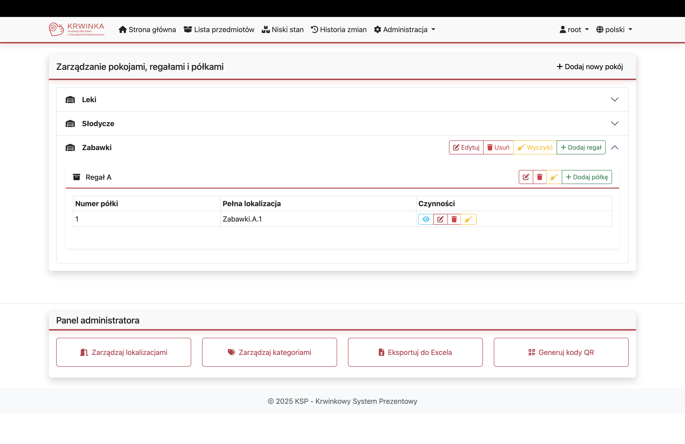

### Manage warehouse racks (admin only)
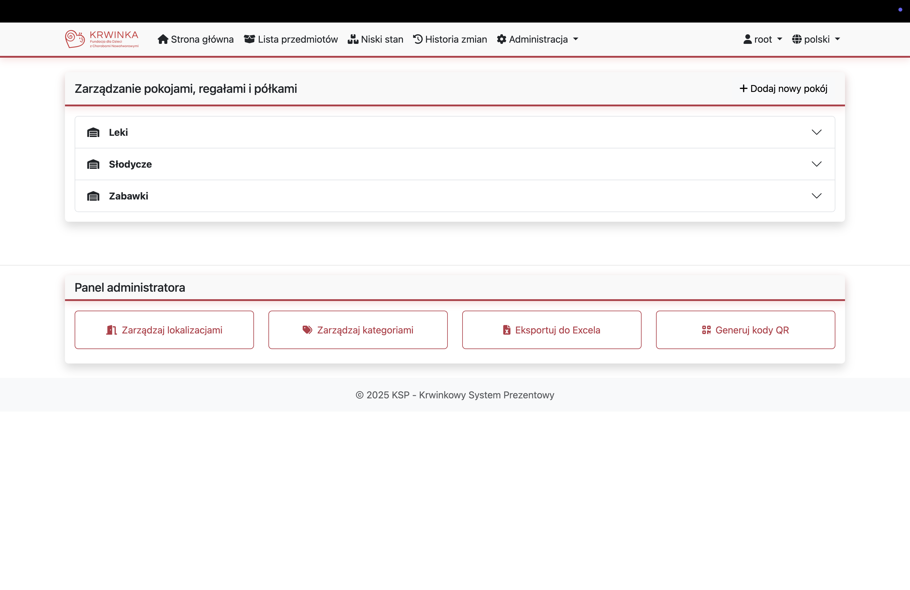

### Manage warehouse shelves (admin only)
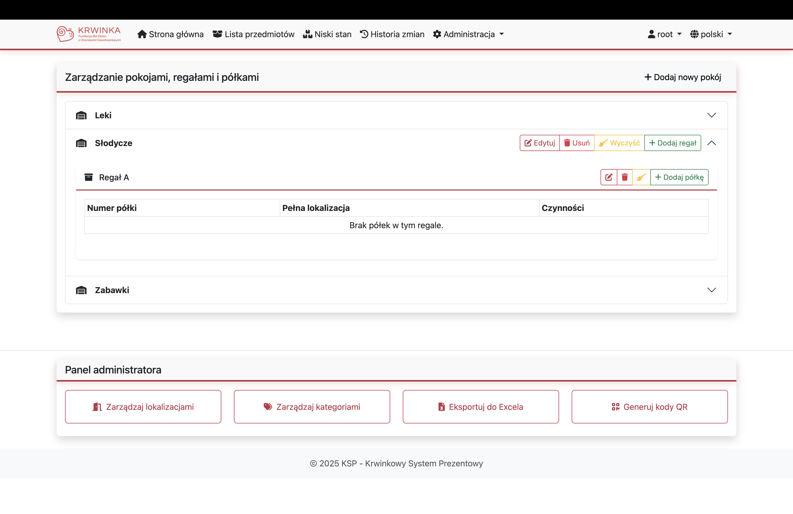

### Create shelf QR codes (admin only)
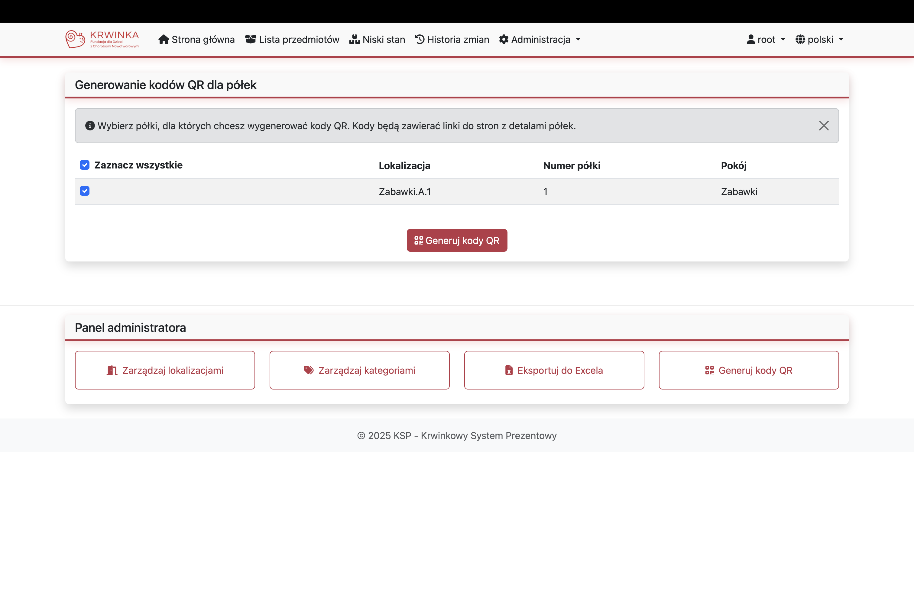

### Add an item to a shelf

### Take an item from a shelf
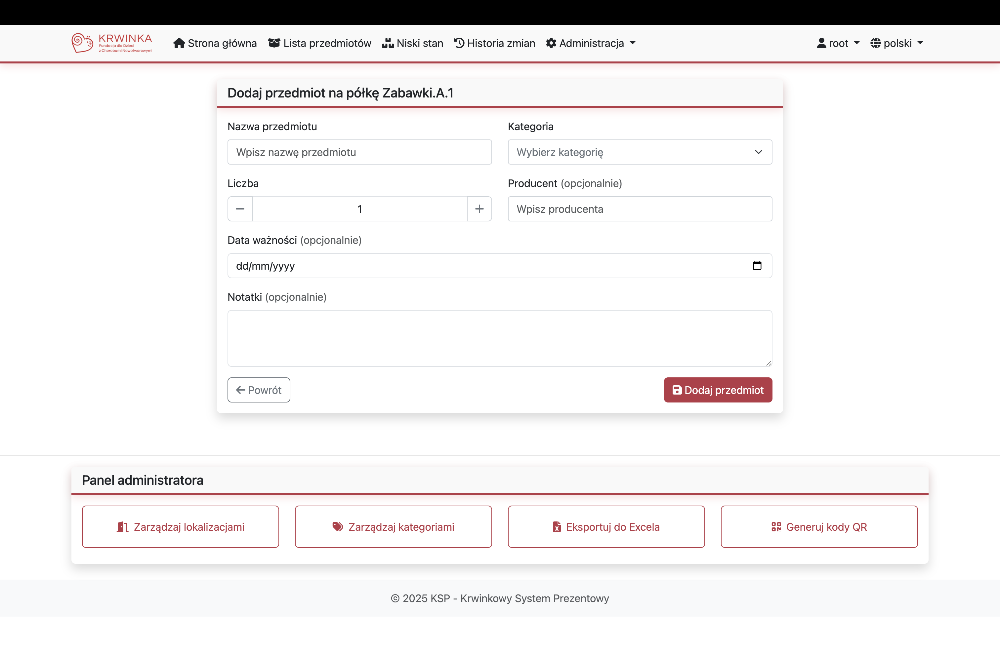

### Move an item to another shelf
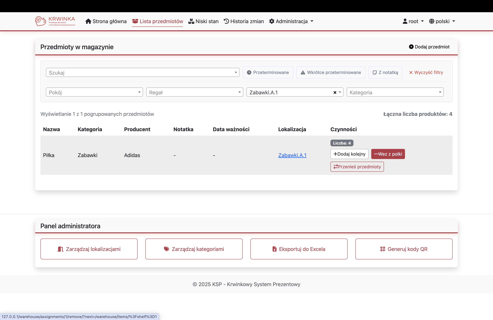

### Show all items
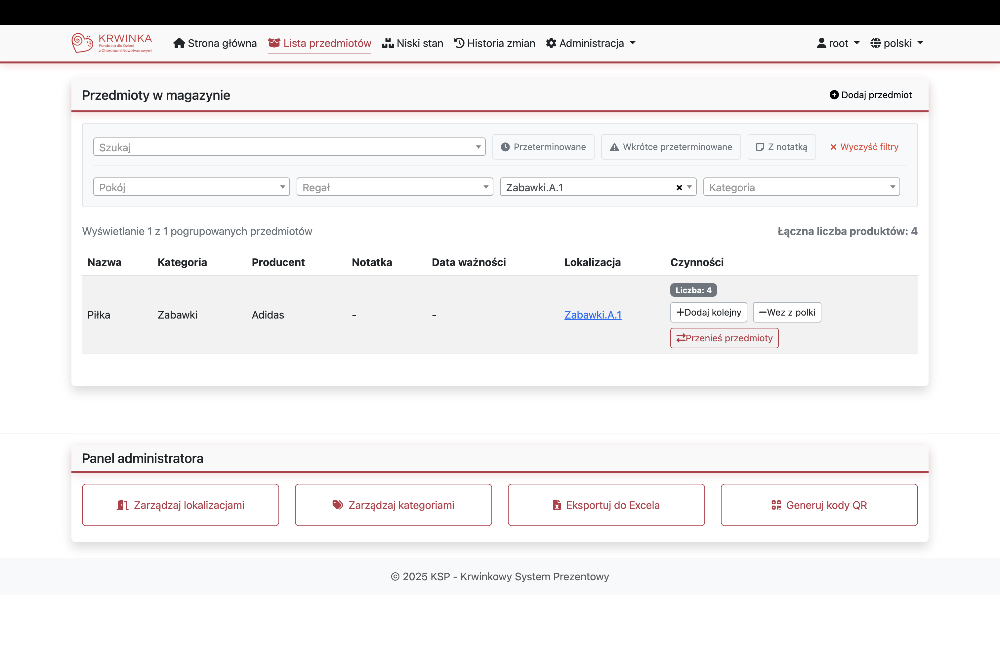

### Show expired or nearly expired items

### Combine the filters
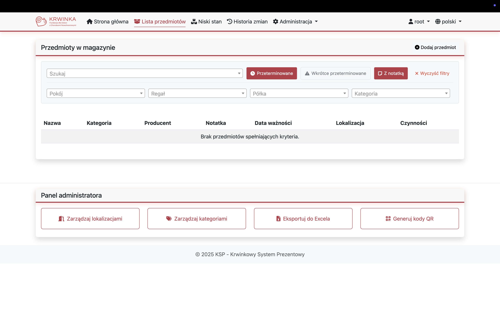

### View low stock categories
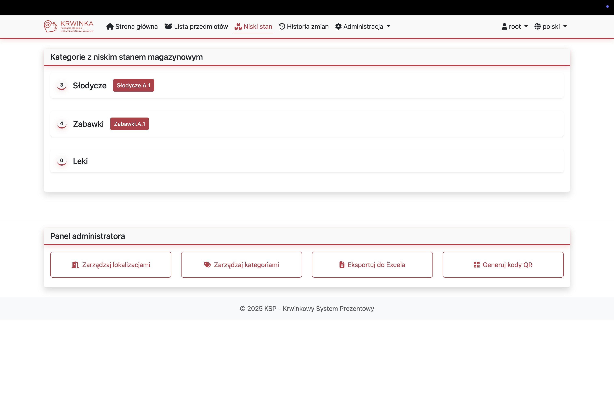

### Export inventory to excel (admin only)
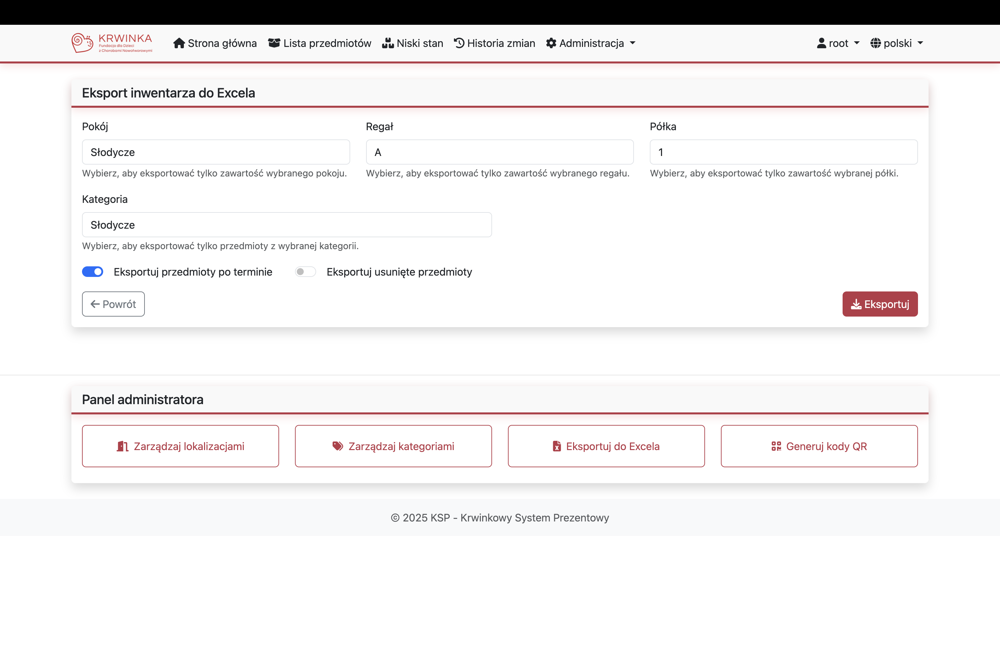