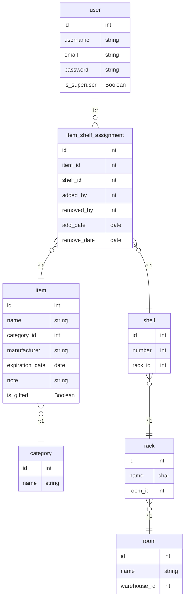

# ce-it-hub-hackathon

```mermaid
erDiagram
    user {
        id int
        username string
        email string
        password string
        is_superuser Boolean
    }
    item_shelf_assignment {
        id int
        item_id int
        shelf_id int
        added_by int
        removed_by int
        add_date date
        remove_date date
    }
    item {
        id int
        name string
        category_id int
        manufacturer string
        expiration_date date
        note string
        is_gifted Boolean
    }
    category {
        id int
        name string
    }
    shelf {
        id int
        number int
        rack_id int
    }
    rack {
        id int
        name char
        room_id int
    }
    room {
        id int
        name string
        warehouse_id int
    }

    user ||--o{ item_shelf_assignment: "1:*"
    item_shelf_assignment }o--|| item : "*:1"
    item }o--|| category : "*:1"
    item_shelf_assignment }o--|| shelf : "*:1"
    shelf }o--|| rack : "*:1"
    rack }o--|| room : "*:1"
```