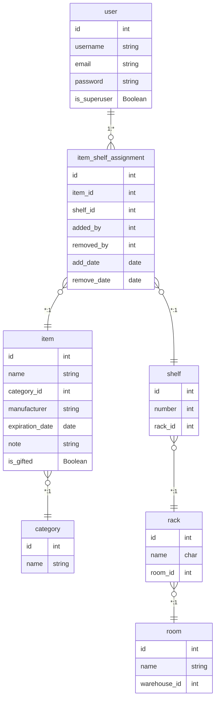

---
hide:
  - navigation
---

### Testowanie funkcjonalności kodów QR

Aplikacja generuje kody QR dla każdej półki, które można zeskanować urządzeniem mobilnym, aby szybko uzyskać dostęp do informacji o półce. Aby to działało poprawnie:

1. Przetestuj kody QR poprzez:  
   - Przejście do strony szczegółów półki (np. `/warehouse/shelves/1`)  
   - Zeskanowanie kodu QR urządzeniem mobilnym  
   - Potwierdzenie, że prowadzi do właściwej strony półki

2. Jeśli skanowanie nie działa lub kody QR pokazują adresy URL z "localhost" (co nie zadziała na urządzeniach mobilnych), musisz ustawić zmienną środowiskową `NETWORK_HOST` na adres IP lub nazwę hosta serwera, uruchamiając `./scripts/set_network_ip.sh`.  
Możesz sprawdzić, czy została poprawnie ustawiona w pliku `.env`.  
Powinieneś zobaczyć: `NETWORK_HOST=twoj-adres-ip-lub-hostname`

### Tłumaczenia aplikacji
Tłumaczenia są generowane automatycznie i dołączone do tego repozytorium.  
Ten dokument dotyczy tylko sytuacji, gdy musisz je wygenerować ponownie po zmianach w kodzie.

Musisz mieć zainstalowany gettext (https://www.drupal.org/docs/8/modules/potion/how-to-install-setup-gettext).

Następnie uruchom poniższe polecenia.

```sh
uv run python manage.py makemessages -l en -l pl
uv run python manage.py compilemessages -l en -l pl
```

### Aktualizacja aplikacji

```sh
git pull
docker compose down
docker compose up -d --build
```

### Tworzenie kopii zapasowej bazy danych
Zaleca się regularne kopie zapasowe bazy danych w środowiskach produkcyjnych.
```sh
docker compose exec db pg_dump -U kspuser ksp > backup_$(date +%Y%m%d).sql
```

### Podgląd logów

```sh
# Logi aplikacji webowej
docker compose logs web

# Logi Nginx
docker compose logs nginx

# Logi bazy danych
docker compose logs db
```

### Model danych bazy

