---
hide:
  - navigation
  - toc
---

### Utwórz swoje konto użytkownika
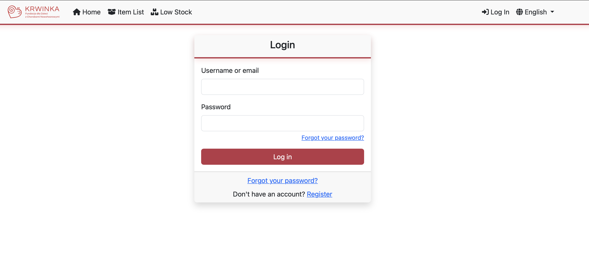

### Zresetuj swoje hasło
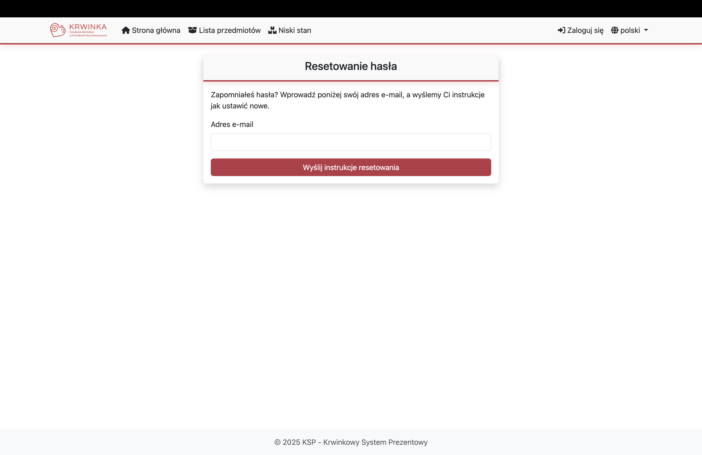

### Zarządzaj kategoriami przedmiotów (tylko administrator)
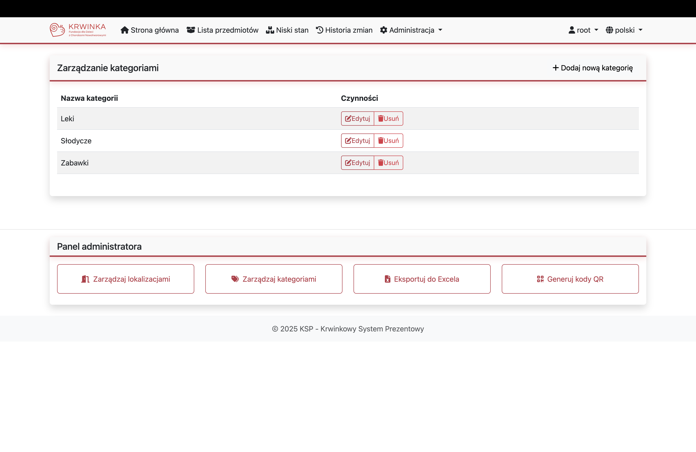

### Zarządzaj pomieszczeniami magazynowymi (tylko administrator)
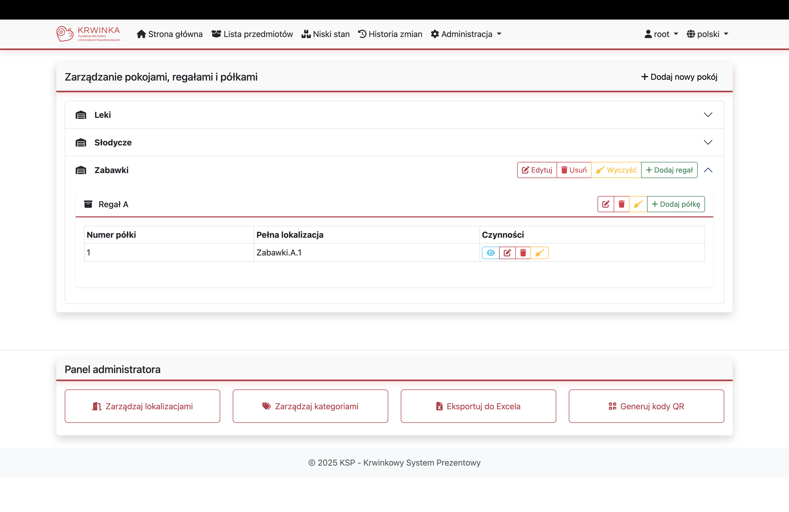

### Zarządzaj regałami magazynowymi (tylko administrator)
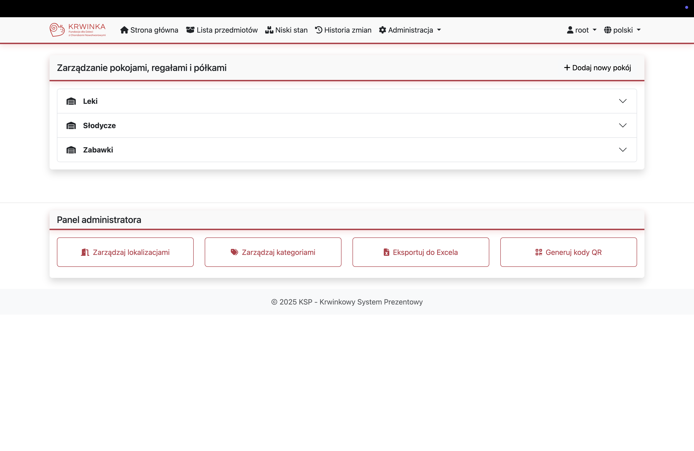

### Zarządzaj półkami magazynowymi (tylko administrator)
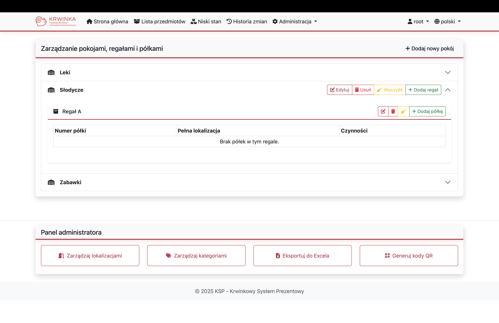

### Generuj kody QR półek (tylko administrator)

### Dodaj przedmiot na półkę

### Pobierz przedmiot z półki

### Przenieś przedmiot na inną półkę
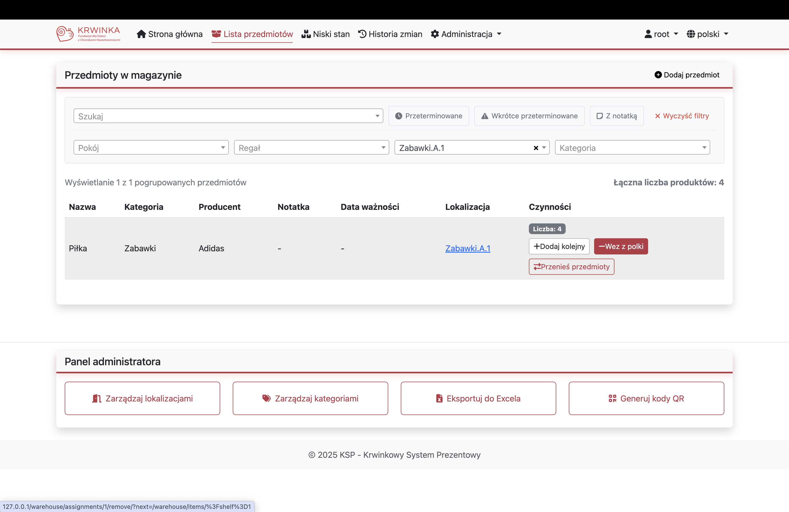

### Wyświetl wszystkie przedmioty
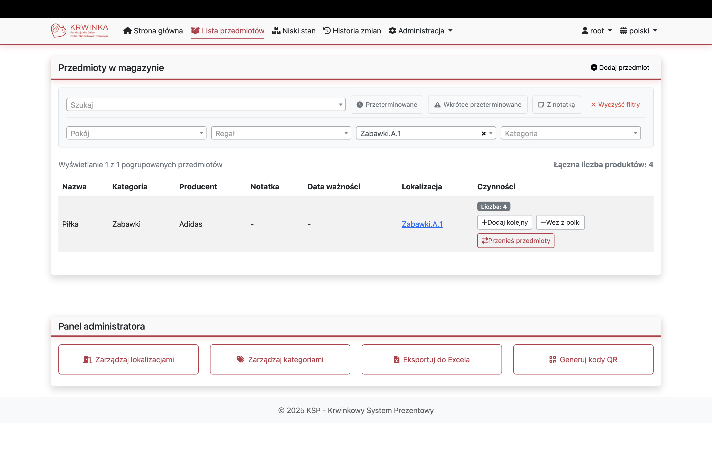

### Wyświetl przedmioty przeterminowane lub bliskie przeterminowania
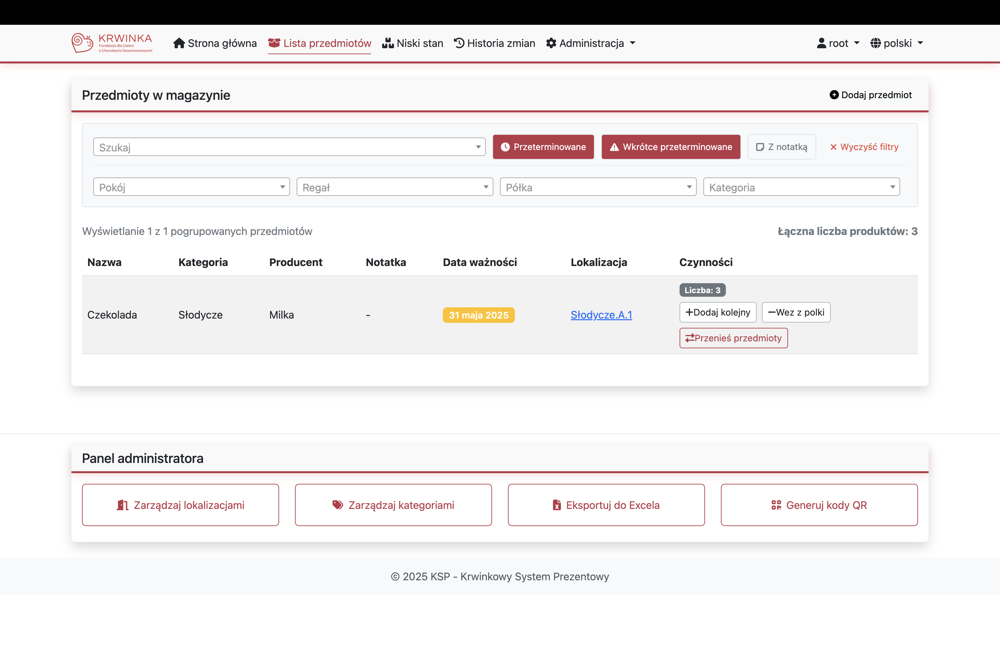

### Łącz filtry
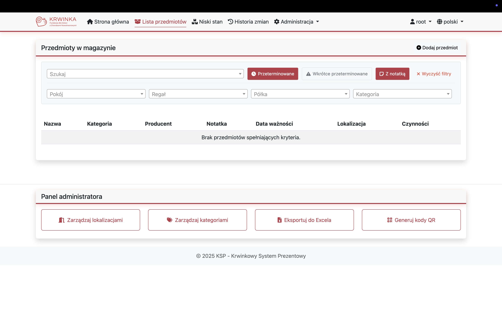

### Wyświetl kategorie o niskim stanie magazynowym
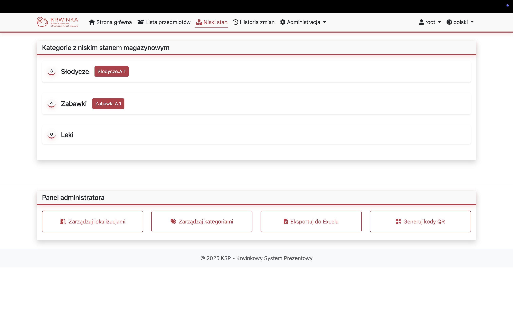

### Eksportuj stan magazynu do Excela (tylko administrator)
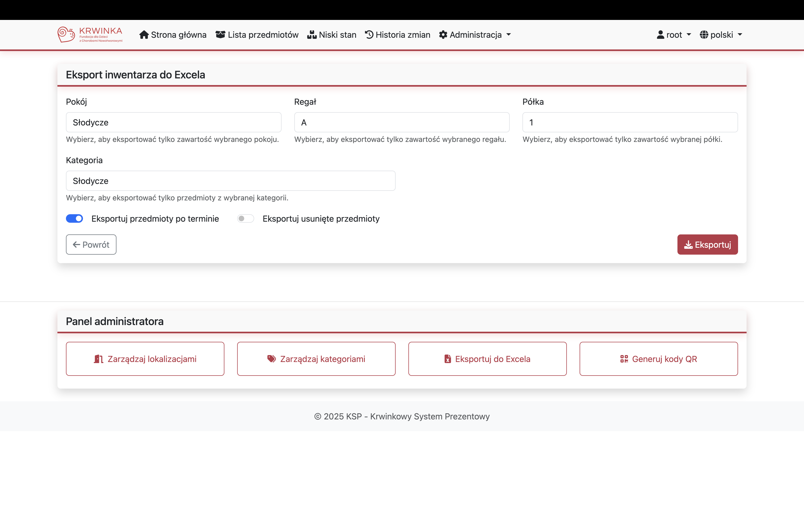